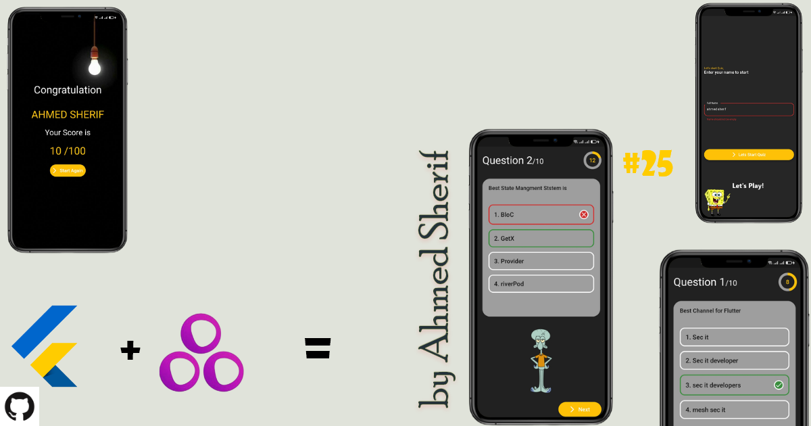
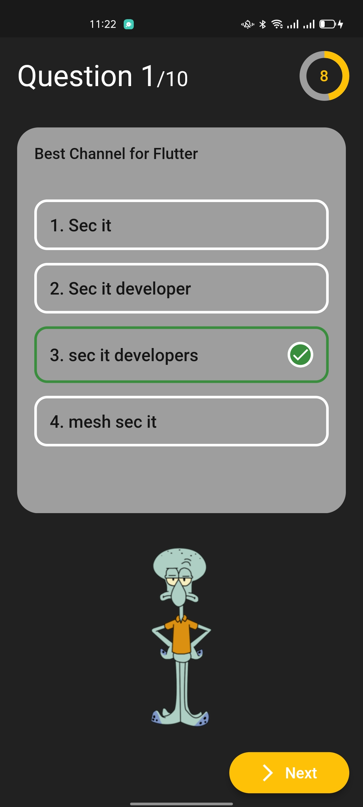

# Quiz App ✍🏻

<b>Quiz App</b>

<b>Quiz App</b>

## About🤠

Quiz app using GetX With PageCotnroller & Timer

## Benfit👻
- [🆗] Welcom Screen
- [🆗] Quiz Screen
- [🆗] 10 Question
- [🆗] 100 mark
- [🆗] Score Screen

- [x] MVC patterns
- [x] Deal With PageController.
- [x] Deal With Timer
- [x] checkAnswer if it True | false
- [x] Content Char Count
- [x] check IsQuestion Answered
- [x] nextQuestion
- [x] resetAnswer
- [✅] startTimer
- [✅] resetTimer
- [✅] stopTimer

## Snapshots

| Welcom Screen
|------
|

| Question One Page | Question Two Dialog|
|------|-------|
|||

| Score Screen
|------
|

